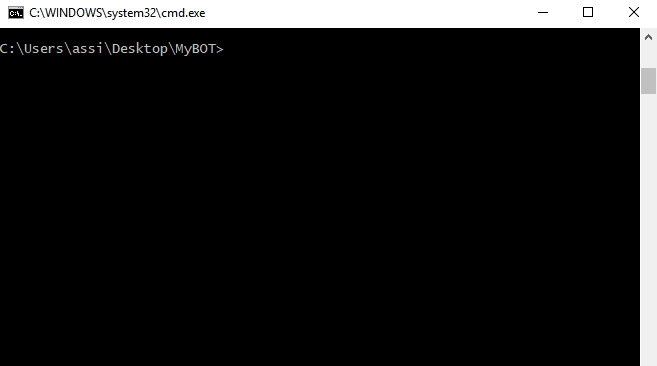
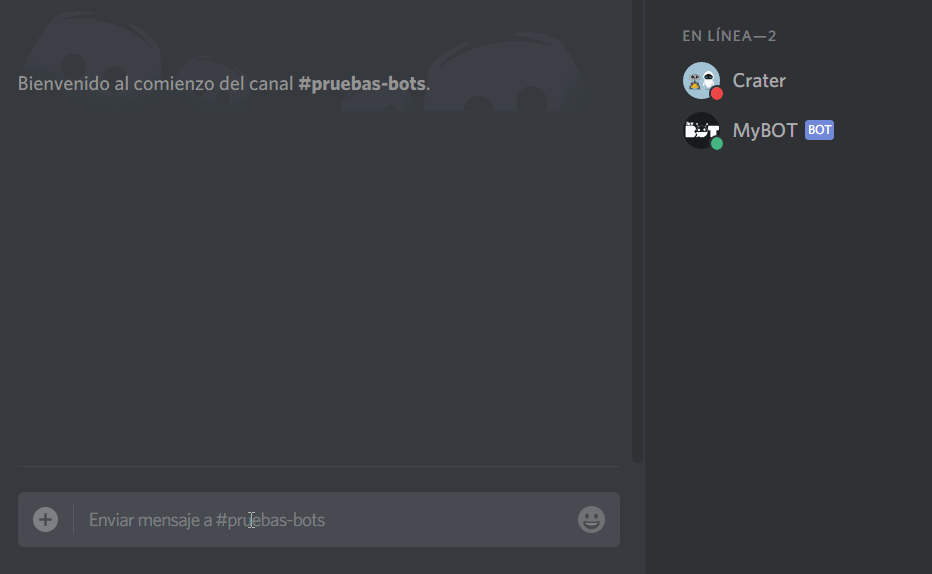

## Guía Discord.js V13.8.0 básico

## Antes de empezar
Usted esta por ver código(script) del lenguaje de programación JavaScript (JS), para desarrollar un bot con discord.js, deberías tener un conocimiento bastante decente del propio JavaScript. Si bien puedes hacer un bot con muy poco conocimiento de programación y JavaScript, tratar de hacerlo sin entender solo te dificultará y quedarse estancado en muchos problemas que para otros sean fáciles.

## Sobre copiar y pegar
Recomendamos firmemente escribir el código a mano mientras sigues los capitulos de esta guía, sin copiar y pegar. Esto te ayudará a desarrollar una memoria muscular y un entendimiento de lo que estas agregando mucho más sólido.

<br>
<br>
<br>
<br>
<br>

<h2 align="center">¡VAMOS ALLÁ!</h2>

### FAQ (Prguntas frecuentes)

<br>

#### ¿Por qué me aparece un error en la última línea de mi código? 
> Respuesta: este error suele pasar porque no cerraste bien algún comando anterior, fíjate si te faltó algún paréntesis ) o alguna llave } o corchete ] por cerrar, este error suele ser muy común cuando estás empezando.


<br>

#### ¿Por qué me aparece este error en mi consola cuando ejecuto mi bot?
```txt
message is not defined
```
> Respuesta: es por que no has definido o puesto dentro del evento message.

<br>

#### ¿Por qué me aparece este error en mi consola cuando ejecuto mi bot?
```txt
args is not defined
```
> Respuesta: es porque no has definido la variable 'args' dentro del evento message.

<br>

#### ¿Cómo puedo hacer que solo yo pueda usar X comando?
```js
//Respuesta:
if (message.author.id !== 'IDUSUARIO') return;
```
> Agregamos esta condicional dentro de un comando para validar que solo pueda ser usado por el usuario que fue agregando en 'IDUSUARO'.

<br>

#### ¿Cómo puedo enviar un mensaje con el BOT al privado(MD) de un usuario?
```js
//Respuesta:
client.users.resolve('IDUSUARIO').send({content: 'MENSAJE'})
```
> Usamos la colección client.users y usando el método get(), ingresamos el id del usuario 'IDUSUARO', para luego usando el método send() enviar el mensaje.

<br>

#### ¿Cómo puedo enviar un mensaje a un canal determinado?
```js
//Respuesta:
client.channels.resolve('IDCANAL').send({content: 'MENSAJE A ENVIAR'});
```
> Usamos la colección client.channels y usando el método get(), ingresamos el id del canal 'IDCANAL', para luego usando el método send() enviar el mensaje determinado.

<br>
<br>
<br>
<br>
<br>

### Editor de código
Un buen editor de código nos ayudará a simplificar y mejorar su código legible, nos dirá donde están los errores, validar y en algunos ejecutar su código por usted.

Para los capítulos y ejemplos de la guáa vamos a utilizar el editor Visual Studio Code, es un editor de código fuente muy ligero y potente que soportar diferentes lenguajes de programación como: (.JS, C ++, C #, Python, PHP, Go) y runtimes (como .NET y Unity), adaptable para Windows, macOS y Linux, muy recomendado.

#### Instalación Visual Studio Code
- Ingresar a la página web de [Visual Studio Code](https://code.visualstudio.com/download).
- Descargar la versión que se adapte a su PC.
- Una vez descargado, ejecute el instalador (VSCodeSetup-version).exe, esto solo tomará unos minutos.

#### Uso de Visual Studio Code
VS Code comienza con una interfaz sencilla, con una pantalla agradable de bienvenida y una guía de uso. Tiene la capacidad de abrir una carpeta de proyecto para que no tengas que seguir abriendo los archivos individualmente y crear grupos de trabajos entre carpetas.

- Abrir Visual Studio Code.
- Vaya a Archivos -> `Abrir Carpeta` o (`CTROL + O`).


- Ubicar la carpeta principal y haga clic en `Seleccionar Carpeta` (Sus archivos no aparecerán, sólo la estructura de la carpeta), o arrastre la carpeta dentro de VSCode.

<br>
<br>
<br>
<br>
<br>

#### Otros editores de código
Hay muchas otras alternativas para poder editar su código, esta es una pequeña lista. Tendrá que buscar instrucciones específicas para estos editores por su cuenta si desea instalarlos y usarlos.

- [Notepad++](https://notepad-plus-plus.org/download/v7.4.2.html)
- [Brackets](http://brackets.io/)
- [Sublime Text 3](https://www.sublimetext.com/3)
- [Atom](https://atom.io/)

No utilice el bloc de notas, no es suficiente.

<br>
<br>
<br>
<br>
<br>

### Creación de su cuenta APP y BOT Discord
El primer paso para crear un primer BOT es crear una aplicación Discord. El bot utilizará la API de Discord, que requiere la creación de una cuenta Discord para propósitos de autenticación. No te preocupes, es súper simple.

Para crear la aplicación, diríjase a la página de [Discord Developers](https://discord.com/developers/applications) e inicie sesión, llegará a una página que se vera así:


Haga clic en `Nueva aplicación`. Esto lo llevará a la siguiente página, donde debe ingresar un nombre para la aplicación.


Acto seguido, puede ingresar un avatar, descripción y tags a su aplicación en la página que se mostrará a continuación, pero todos estos campos serán opcionales. Lo que deberá usted hacer es dirigirse al apartado `Bot` del menú de la izquierda.


En la pestaña `Bot` presione el botón `Añadir bot`. Esto transformará instantáneamente su aplicación en una aplicación de bot.<br>
Ingrese ahora el nombre y avatar que desea darle al bot.


Una vez terminado esto, baje por la página y personalice los permisos de su bot, desde si se tratará de un bot público (que cualquiera pueda añadir a su servidor) o si podrá leer los mensajes que la gente envíe en los diferentes canales de texto.<br>

**¡ENHORABUENA!**<br>
Has creado un bot, ahora falta agregarlo a un servidor y programarlo.

<br>
<br>
<br>
<br>
<br>

### Añadir mi bot a un servidor

En el menú de su aplicación de [Discord Developers](https://discord.com/developers/applications) diríjase en el menú lateral izquierdo al apartado `OAuth2`, esto desplegará una lista con dos opciones. Deberá dirigirse a la segunda (`URL Generator` o `Generador de URL`)


Seleccione las opciones de su aplicación para crear un enlace desde el que poder añadir su bot a un servidor.<br>
Dado que se trata de un bot necesitaremos en el primer menú de las opciones `bot` y `aplications.commands`. Al seleccionar estas, se nos desbloqueará un nuevo cuadro debajo del primero, en el que podremos especificar los permisos que nuestro bot solicitará al servidor al que se una.
> NOTA IMPORTANTE: Aún que nuestro bot solicite estos permisos, el usuario que lo añada podría denegárselos, por lo que no podremos confiarnos pensando que nuestro bot siempre y en todos los servidores los poseerá.

Una vez hayamos seleccionado todas las opciones, en la línea inferior se debería encontrar un link, desde el cuál podremos invitar a nuestro bot.


<br>
<br>
<br>
<br>
<br>

### Instalación de Discord.js y Node.js
Para usar discord.js y empezar a programar necesitará un par de cosas instaladas. Por lo menos:
- Mínimo: node.js versión 14 o superior.
- Tener un editor de código real. Si no tienen instalado un editor de código ir a la [Instalación editor de código](#editor-de-código)

<br>

#### Instalación de Nodejs
Node es un entorno de ejecución para JavaScript, usa un modelo de operaciones E/S sin bloqueo y orientado a eventos, que lo hace liviano y eficiente.

Para instalar Node, vamos a la siguiente página web [Nodejs.org](https://nodejs.org/es/).<br>
Descargar la versión recomendada e instalar en su PC. (Reinicié su PC si es necesario)

<br>

#### Preparando el entorno de programación para su BOT
Una vez que tenga el software requerido, el siguiente paso es preparar un espacio para empezar a programar.

- Crear una carpeta en el escritorio o en una unidad de disco duro o partición.
- Darle un nombre a la carpeta (Ejm. BOT, BotDiscord, MyBOT, etc.).
- Una vez que haya creado una carpeta, abrir la consola (interfaz de línea de comandos) con al ruta de la carpeta.



Si no pudo abrir la consola con la ruta, sigue estos pasos: (en Windows)
- Presionar la tecla de `Windows(⊞ Win) + R y escribir` "cmd", luego clic en Aceptar para abrir la consola.


- Una vez dentro de la consola escribir lo siguiente: cd desktop\MyBOT (MyBOT es el nombre de la carpeta creada).

Listo, ahora vayamos al siguiente paso.

#### Instalación de Discord.js
Una vez dentro de la consola con la ruta de la carpeta, vamos a instalar Discord.js.

Pero primero vamos a inicializar esta carpeta con node y npm (NPM = Node Package Manager - Administrador de paquetes/librerias para node), esto asegurará que cualquier otro módulo instalado se instale dentro de la carpeta creada.

Si queremos ver la información de NPMs de nuestro bot podremos usar `npm init -y` pero en esta ocasión instalaremos un NPM por medio de `npm -i --save <nombre>`.

Vamos a instalar el [NPM de discord.js](https://www.npmjs.com/package/discord.js), para ello emplearemos `npm -i --save discord.js`.

> NOTA: `--save` o `--s` es para asegurar que se guarde en el package.json que creamos anteriormente. 

La instalación es muy rápida y mostrará el proceso de la instalacián en la pantalla de la consola.

Una vez completada la instalación de Discord.js, nos fijamos en la carpeta y se dará cuenta de que hay una nueva carpeta creada llamada node_modules. Esto contiene todos los paquetes instalados para el funcionamiento de Discord.js.

Significa que Discord.js se ha instalado correctamente. ¡Bien hecho! Ahora vayamos a poner en marcha su primer BOT.

<br>
<br>
<br>
<br>
<br>

### En marcha mi primer bot
Empezamos a codificar los eventos y funciones para desarrollar su BOT, con una estructura basica de inicio.

- Abrir la carpeta de su BOT creado, con Visual Studio Code o con el editor que tenga instalado.
- Crear un nuevo archivo y darle un nombre con la extencion .js (archivo JavaScript).
- Ejemplos: mybot.js, bot.js, app.js, etc. (Para esta guía utilizaré mybot.js)


Luego de crear el archivo para su BOT, dentro del archivo agregamos las siguientes lineas de codigo:
```js
const Discord = require("discord.js");
const client = new Discord.Client({
  intents: [
    "GUILDS",
    "DIRECT_MESSAGES",
    "GUILD_MEMBERS",
    "DIRECT_MESSAGE_REACTIONS"  ,
    "GUILD_BANS",
    "DIRECT_MESSAGE_TYPING"     ,
    "GUILD_EMOJIS_AND_STICKERS",
    "GUILD_INTEGRATIONS",
    "GUILD_WEBHOOKS",
    "GUILD_INVITES",
    "GUILD_VOICE_STATES",
    "GUILD_PRESENCES",
    "GUILD_MESSAGES",
    "GUILD_MESSAGE_REACTIONS",
    "GUILD_MESSAGE_TYPING",
  ]
});
```
> **Descripción del código agregado** <br>
> 
> `const` crea una variable/constante llamada "*Discord*" para referenciar el modulo npm discord.js instalado anteriormente.
> 
> `const` crea la constante "*client*" para instanciar una nueva clase Client() de la variable Discord referenciado, client representa a la clase Client() que es el eje principal para interactuar con la API de Discord, y el punto de partida para cualquier BOT en discordjs. Dentro de ésta indicamos los intents que el bot poseerá, es decir, las acciones que el bot podrá leer.>
>
> NOTA IMPORTANTE: Algunos intents requieren de permisos especiales en la consola de aplicaciones de Discord. Si desea activarlos, puede encontrarlos en la pestaña "Bot" de la consola de [Discord Developers](https://discord.com/developers/applications)

<br>

Despues, agregamos las siguientes lineas de codigo debajo de las variables creadas anteriormente.

```js
client.on('ready', () => {
   console.log(`Estoy listo!`);
});

client.on('message', (message) => {
  if(message.content.startsWith('ping')) {
    message.channel.send(`pong 🏓!!`);
  }

});

client.login('TokenSecreto');
```

> **DESCRIPCIÓN DEL CÓDIGO:**
> 
> En la primera linea la varible "*client*" activa el evento llamado "*ready*", "*ready*" es el evento de inicio cuando se activa un BOT en discord.js, se puede ingresar un mensaje o funcion que se ejecutara cuando el BOT se aya activado correctamente.
> 
> Utilizamos tambien el evento "*messageCreate*", "*messageCreate*" es el manejador de los mensajes y argumentos de un servidor, detro del mismo podemos crear comandos(funciones/tareas) para su BOT. Un ejemplo basico es el comando ping. dentro de una condicion if() basica.

<br>

Bien, luego de agregar las lineas de codigo, ahora reemplace en la linea del metodo client.login("TokenSecreto") por el Token de su BOT. Para encontrarlo, diríjase a la pestaña "bot" de la consola de [Discord Developers](https://discord.com/developers/applications) y observará un botón denominado "Reset Token", al hacer click sobre éste se le mostrará una "contraseña", un código identificador, se trata de su token secreto, no lo revele nunda a nadie.


Por ultimo guardar todo su codigo agregado, utilizando la tecla `CONTROL + S`

<br>
<br>
<br>
<br>
<br>

### Activación del BOT
La manera de activar un BOT mendiante la consola de windows, es ingresando a la ruta de la carpeta de su BOT. y utilizar el comando de nodejs llamada `node`, mas el nombre del archivo de su bot.

> Ejemplo: `node mybot.js` ó `node mybot` sin la extenciòn .js, las dos formas generan la misma acción.


Si en su consola aparecio un mensaje "*Estoy listo!*" generado por el evento ready, su BOT estara conectado en su servidor invitado.

**¡Genial!** Su bot esta listo para responder a todas sus órdenes, en el ejemplo de la estructura basica su BOT respondera con un mensaje "*pong!*", a cualquier mensaje que empiece exactamente con "*ping*" del evento message, vamos a comprobarlo.



¡Éxito tienes tu BOT ejecutándose!, ahora podras crear muchas funciones/tareas y comandos para su BOT. La activación de su primer BOT se ha completado.

<br>
<br>
<br>
<br>
<br>

### ¿Que sigue?
Usted tiene desarrollado un BOT básico para discord, es hora de comenzar a agregar nuevas características!.

<br>
<br>
<br>
<br>
<br>

### Uso de un prefix (simbolo indentificador)
Usted puede ser que haya visto en muchos bots que responden a los comandos con un prefix unico y específicio. Ya sea un signo de exclamación `!`, un signo de `+`, un signo de interrogación `?` u otros carácteres. Esto es muy útil para:

En primer lugar, si no utiliza un prefix único y tiene más de un BOT en un servidor, ambos responderán a los mismos comandos.

En segundo lugar, en el ejemplo basico su BOT responden cuando el mensaje comienza con `ping` que son 4 caracteres, esto significa que la siguiente frase provocará la respuesta del BOT.

Para evitar todo estos casos se usa un prefix unico, vamos a crear un prefix, así como la capacidad de cambiar el prefix cuando guste desde un solo lugar.

Bien, hay dos formas de poder crear y usar una variable como prefix:

1. Creando una varible dentro del mismo archivo de su bot como prefix.
2. Dividir en partes la configuración de variables, creando un archivo `json`

Vamos por la forma mas recomendada, en crear un archivo `.json` para nuestra configuración de variables.

<br>

#### Creando un archivo json para nuestra variables
Crear un nuevo archivo dentro de la carpeta del bot y darle el nombre de `config.json` (`.json` es la extención del archivo).


JSON, son notaciones de objetos para javascript, mas información en [json.org](https://www.json.org/json-es.html)


Ahora que ya hemos creado el archivo de configuración hay 2 cosas de inicio que podemos agregar al archivo, son:

- El token de su BOT
- El prefix de su BOT

Asi como otros datos que considere de prioridad unica durante el desarrollo.<br>
Agregar las siguientes lineas de configuración dentro del archivo `.json` creado.

```json
{
  "token":"tokenSecreto",
  "prefix":"!"
}
```

Despues de agregar usted puede cambiar el objeto prefix con el simbolo para el prefix de su BOT, para el ejemplo usare el simbolo `!` como prefix. Tambien copie el token de su BOT en el objeto token del archivo de configuración.

Guarde la configuración usando `CONTROL + S`

<br>

#### Referenciando el archivo de configuración json
-------------------------------------------------------------------
#### OPCIÓN 1
Nos dirigimos a la parte superior del archivo de su BOT (`mybot.js`), agregamos una nueva línea de codigo para referenciar al archivo `config.json` mediante una constante.
```js
const config = require("./config.json");
```

> **DESCRIPCIÓN DEL CÓDIGO:**
> 
> `const` crea una constante con el nombre `config` para referenciar al archivo de configuración `config.json` creado anteriormente.
> 
> Ahora usted utilizara la constante `config` para llamar a los objetos que estan dentro del archivo de configuración `config.json`.
> - Para llamar o utilizar el objeto prefix escribimos: `config.prefix`
> - Para llamar o utilizar el objeto token escribimos: `config.token`

##### Usando la constante de configuración 'config'
Vamos a usar la constante `config` que representa el archivo de configuración, primero cambiamos el token llamando al objeto token mediante la constante `config`.

La linea de nuestro bot se ve así:
```js
client.login("MzASfasFWf_asdASDKKW-SFASfasFWf#f3KKsds51.sDSd");
```
Usando config y el objeto token seria así:
```js
client.login(config.token);
```
Listo, la otra linea que tenemos que agregar es el objeto prefix, vamos a la linea de nuestro codigo debajo de config y agregamos el prefix creando una nueva variable para los comandos, de esta forma:
```js
let prefix = config.prefix;
```
Despues de agregar y referenciar nuestro archivo de configuración `config.json` a nuestro BOT, esto se deberia de ver así:
```js
const Discord = require("discord.js");
const client = new Discord.Client();
const config = require("./config.json");

let prefix = config.prefix;

client.on('ready', () => {
   console.log(`Estoy listo!`);
});

client.on('message', (message) => {
  if(message.content.startsWith(prefix + 'ping')) {
    message.channel.send(`pong 🏓!!`);
  }

});

client.login(config.token);
```
<br>

-------------------------------------------------------------------

#### OPCIÓN 2
Nos dirigimos a la parte superior del archivo de su BOT (`mybot.js`), agregamos una nueva línea de codigo para referenciar al archivo `config.json` mediante una constante.
```js
const { prefix, token } = require("./config.json");
```

> **DESCRIPCIÓN DEL CÓDIGO:**
> 
> `const` crea dos constantes con los nombre `prefix` y `token` que harán referencia al objeto que tenga el mismo nombre en el archivo `config.json` creado anteriormente.
> 
> - Para llamar o utilizar el objeto prefix escribimos: `prefix`
> - Para llamar o utilizar el objeto token escribimos: `token`

##### Usando las constantes de configuración

Vamos a usar las constantes `prefix` y `token` que representan los datos que queremos obtener del archivo `config.json`

La linea de nuestro bot se ve así:
```js
client.login("MzASfasFWf_asdASDKKW-SFASfasFWf#f3KKsds51.sDSd");
```
Usando config y el objeto token seria así:
```js
client.login(token);
```
Despues de todo esto, nuestro código debería quedar así:
```js
const Discord = require("discord.js");
const client = new Discord.Client();
const { prefix, token } = require("./config.json");

client.on('ready', () => {
   console.log(`Estoy listo!`);
});

client.on('message', (message) => {
  if(message.content.startsWith(prefix + 'ping')) {
    message.channel.send(`pong 🏓!!`);
  }

});

client.login(token);
```

-------------------------------------------------------------------

Ahora agregamos un nuevo comando de ejemplo basico para probar con el nuevo prefix

<br>
