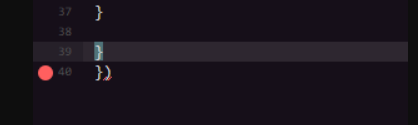

## Guía Discord.js V13.8.0 básico

### FAQ (Prguntas frecuentes)

<br>

#### ¿Por qué me aparece un error en la última línea de mi código? 
> Respuesta: este error suele pasar porque no cerraste bien algún comando anterior, fíjate si te faltó algún paréntesis ) o alguna llave } o corchete ] por cerrar, este error suele ser muy común cuando estás empezando.



<br>

#### ¿Por qué me aparece este error en mi consola cuando ejecuto mi bot?
```txt
message is not defined
```
> Respuesta: es por que no has definido o puesto dentro del evento message.

<br>

#### ¿Por qué me aparece este error en mi consola cuando ejecuto mi bot?
```txt
args is not defined
```
> Respuesta: es porque no has definido la variable 'args' dentro del evento message.

<br>

#### ¿Cómo puedo hacer que solo yo pueda usar X comando?
```js
//Respuesta:
if (message.author.id !== 'IDUSUARIO') return;
```
> Agregamos esta condicional dentro de un comando para validar que solo pueda ser usado por el usuario que fue agregando en 'IDUSUARO'.

<br>

#### ¿Cómo puedo enviar un mensaje con el BOT al privado(MD) de un usuario?
```js
//Respuesta:
client.users.resolve('IDUSUARIO').send({content: 'MENSAJE'})
```
> Usamos la colección client.users y usando el método get(), ingresamos el id del usuario 'IDUSUARO', para luego usando el método send() enviar el mensaje.

<br>

#### ¿Cómo puedo enviar un mensaje a un canal determinado?
```js
//Respuesta:
client.channels.resolvet('IDCANAL').send({content: 'MENSAJE A ENVIAR'});
```
> Usamos la colección client.channels y usando el método get(), ingresamos el id del canal 'IDCANAL', para luego usando el método send() enviar el mensaje determinado.

<br>
<br>
<br>
<br>
<br>

<div align="center">
    <kbd>
        <br>
        <a href="">Anterior página</a>
        <br>
        
    </kbd>
    <kbd>
        <br>
        <a href="">Siguiente página</a>
        <br>
        
    </kbd>
</div>